# Azure Security & SIEM Deployment

**Deploying Microsoft Sentinel on Azure, onboarding a hybrid Windows + Linux estate through the Azure Monitor Agent, validating ingestion with KQL, and proving detection by running a live SSH brute-force attack against a target VM.**


> A hands-on SOC lab. Part one builds and validates the SIEM foundation; part two attacks it and catches the attack in Sentinel — closing the loop between *collecting* logs and *detecting* an intrusion.

---

## Table of contents

- [Overview](#overview)
  - [Presentation](#-presentation)
- [Architecture](#architecture)
- [Technology stack](#technology-stack)
- [Part 1 — Deployment](#part-1--deployment)
  - [1. Foundation](#1-foundation)
  - [2. Compute](#2-compute)
  - [3. Log ingestion](#3-log-ingestion)
  - [4. Verification with KQL](#4-verification-with-kql)
  - [5. Portal migration](#5-portal-migration)
- [Part 2 — Attack simulation & detection](#part-2--attack-simulation--detection)
  - [Scenario](#scenario)
  - [Reaching the target](#reaching-the-target)
  - [Launching the brute force](#launching-the-brute-force)
  - [Onboarding the target for detection](#onboarding-the-target-for-detection)
  - [Catching the attack in Sentinel](#catching-the-attack-in-sentinel)
- [Validation summary](#validation-summary)
- [Observations & good practice](#observations--good-practice)
- [Next steps](#next-steps)
- [Repository structure](#repository-structure)
- [Disclaimer](#disclaimer)

---

## Overview

This project stands up a working [Microsoft Sentinel](https://learn.microsoft.com/azure/sentinel/) environment from scratch and then tests it against a real attack.

A single resource group, `rgSIEM`, hosts the whole lab in the **East US** region. A Log Analytics workspace collects every log produced by the virtual machines and other log-generating systems, and Microsoft Sentinel is enabled on top of that workspace to deliver SIEM capabilities. Kusto Query Language (KQL) is then used to interrogate the collected data and turn raw events into meaningful security insight.

At a glance:

| | |
|---|---|
| **Virtual machines** | 2 — Windows 11 Pro + Ubuntu 24 |
| **Data connectors** | 3 — Azure Activity, Windows Security Events, Syslog |
| **Data collection rules** | 2 — one per operating system |
| **Log Analytics workspace** | 1 — `LAWmuler`, Sentinel-enabled |
| **Attack simulated** | SSH brute force (Hydra) → detected in Sentinel |

### 📊 Presentation

The full project is also available as a slide deck (charcoal & molten-orange theme, 25 slides):

- **[Download the PowerPoint](Azure-Security-SIEM-Deployment.pptx)** (`.pptx`)
- **[View the PDF](Azure-Security-SIEM-Deployment.pdf)** — renders inline on GitHub, no PowerPoint needed

---

## Architecture

Everything lives inside one subscription and one resource group. The virtual machines emit telemetry, Data Collection Rules scope what the Azure Monitor Agent forwards, and the Log Analytics workspace — with Sentinel enabled on top of it — is the single analytics plane.

```
┌─ Azure subscription 1 ─────────────────────────────────────────────────────┐
│                                                            Region: East US  │
│  ┌─ Resource group · rgSIEM ─────────────────────────────────────────────┐  │
│  │                                                                       │  │
│  │   COMPUTE                COLLECTION                ANALYTICS & SIEM    │  │
│  │  ┌──────────────┐       ┌────────────────┐       ┌──────────────────┐ │  │
│  │  │  WindowsVM   │──────▶│  mywindowsDCR  │──────▶│  LAWmuler        │ │  │
│  │  │  Win 11 Pro  │       │  security evts │       │  Log Analytics   │ │  │
│  │  ├──────────────┤       ├────────────────┤       │  ┌─────────────┐ │ │  │
│  │  │  UbuntuVM    │──────▶│ myubuntuDCRnew │──────▶│  │ MS Sentinel │ │ │  │
│  │  │  Ubuntu 24   │       │  syslog        │       │  └─────────────┘ │ │  │
│  │  └──────────────┘       └────────────────┘       └──────────────────┘ │  │
│  │        Azure Monitor Agent on both      Tables: SecurityEvent ·        │  │
│  │                                         Syslog · AzureActivity         │  │
│  │                                                                       │  │
│  │   Supporting infra: vnet-eastus-1 · Bastion · NSG · Public IP · SSH key │  │
│  └───────────────────────────────────────────────────────────────────────┘  │
└─────────────────────────────────────────────────────────────────────────────┘
```

The key relationship: **Microsoft Sentinel is not a separate product beside the workspace — it is enabled *on* the Log Analytics workspace.** The `SecurityInsights (lawmuler)` solution is what turns a plain log store into a SIEM.

---

## Technology stack

| Component | Role |
|---|---|
| **Azure Portal** | Primary control plane used to create and configure every resource in the lab. |
| **Microsoft Sentinel** | Cloud-native SIEM and SOAR layered directly on the Log Analytics workspace. |
| **Log Analytics workspace** (`LAWmuler`) | The single store for all ingested machine and platform logs. |
| **Azure Monitor Agent (AMA)** | Modern unified collection agent that replaces the legacy MMA, on both Windows and Linux. |
| **Data Collection Rules** (`mywindowsDCR`, `myubuntuDCRnew`) | Define exactly which events each agent sends and to which workspace. |
| **Kusto Query Language (KQL)** | Query language used to verify ingestion and extract security insight. |
| **Hydra** | Parallelised login-cracking tool used for the SSH brute-force simulation. |

---

## Part 1 — Deployment

### 1. Foundation

A dedicated resource group, `rgSIEM`, was created to hold the entire lab, followed by the `LAWmuler` Log Analytics workspace. Grouping the workspace, rules and machines together keeps lifecycle, access control and cost reporting in one place — and lets the whole lab be torn down in a single operation.

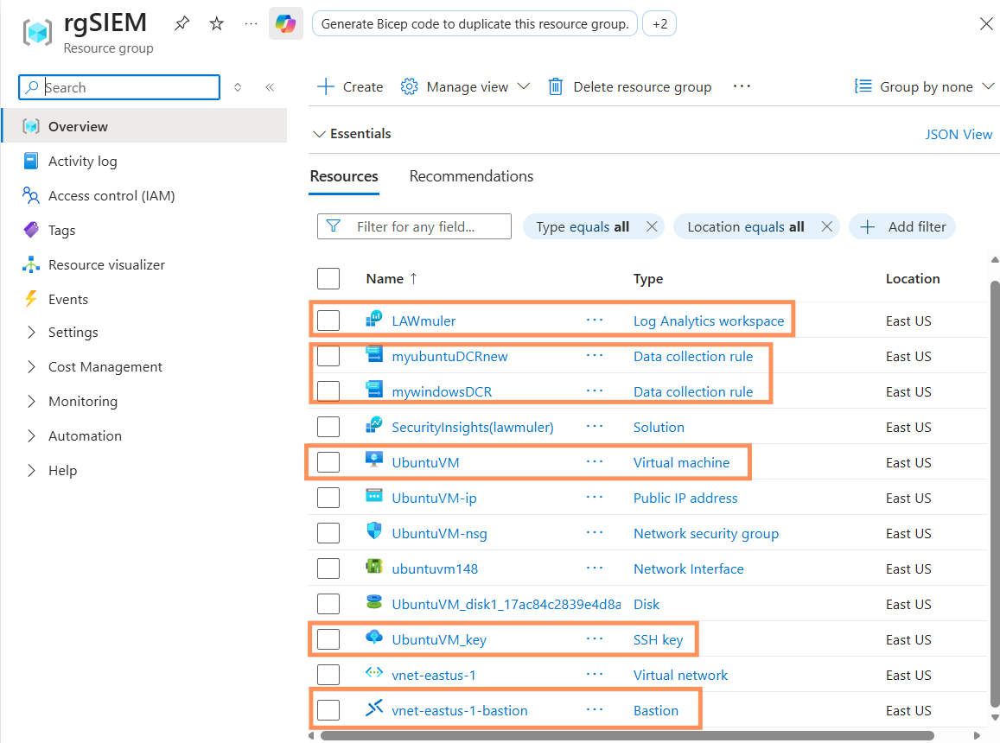
<sub>**Figure 1** — The `rgSIEM` resource group: workspace, Sentinel solution, both DCRs, both VMs and their supporting network/access resources, all in East US.</sub>

> **Design rule applied throughout:** the virtual machines and the Log Analytics workspace are deployed in the **same Azure region** to minimise latency and avoid cross-region data-egress charges.

### 2. Compute

Two virtual machines were provisioned into `rgSIEM` to represent a realistically mixed estate:

| VM | OS | Size | Telemetry |
|---|---|---|---|
| `WindowsVM` | Windows 11 Pro | `Standard_F1ads_v7` | Windows security event log |
| `UbuntuVM` | Ubuntu 24 | `Standard_D2alds_v7` | `rsyslog` facilities |

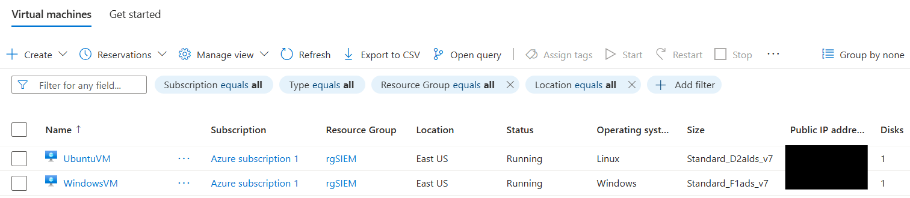
<sub>**Figure 2** — Both instances running in `Azure subscription 1` / `rgSIEM` / East US.</sub>

### 3. Log ingestion

Three data connectors were installed from the Content Hub. Collection is handled by the **Azure Monitor Agent**, and each machine is bound to a **Data Collection Rule** that defines precisely which events are gathered — scoping collection at the rule level keeps ingestion volume, and therefore cost, under control.

| Connector | Scope | What it does |
|---|---|---|
| **Azure Activity** | Subscription | Control-plane audit trail — who created, changed or deleted a resource, and when. |
| **Windows Security Events via AMA** | `WindowsVM` | Streams the full Windows security event log for dashboards, custom alerts and investigation. |
| **Syslog via AMA** | `UbuntuVM` | The Linux agent reconfigures the local syslog daemon to forward messages, which the agent ships to the workspace. |

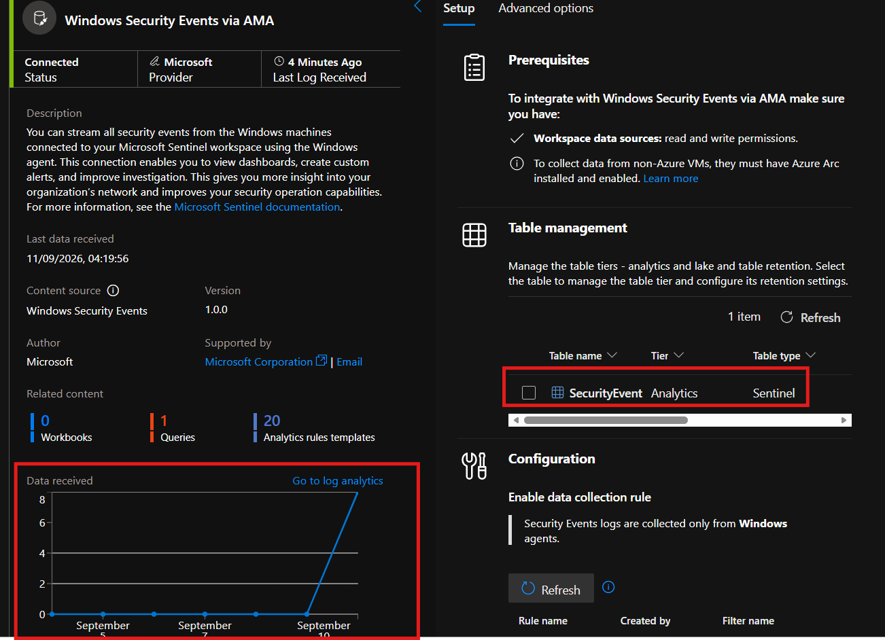
<sub>**Figure 3** — Windows Security Events via AMA: status **Connected**, the `SecurityEvent` table on the Analytics tier, and the data-collection rule enabled for Windows agents.</sub>

**Syslog ingestion path:** `Application → rsyslog daemon → Azure Monitor Agent → LAWmuler workspace`

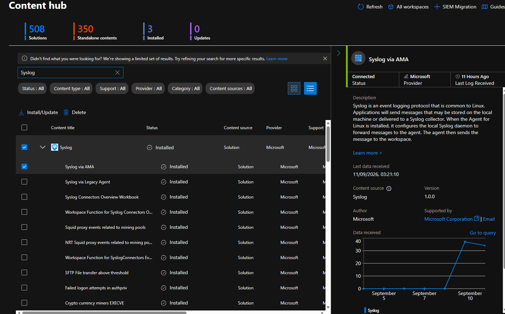
<sub>**Figure 4** — The Syslog solution installed from the Content Hub, connector reporting **Connected**.</sub>

### 4. Verification with KQL

Ingestion is only proven once queries return data. Two quick sanity checks confirmed both pipelines.

**Windows:**

```kql
SecurityEvent
| take 10
```

The result returned ten rows in ~2 seconds, with the `Computer` column resolving to `WindowsVM`, an event source of `Microsoft-Windows-Security-Auditing`, and accounts including `IT.ADMIN`.

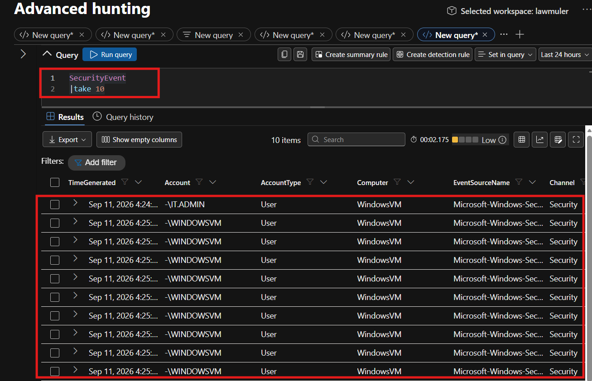
<sub>**Figure 5** — `SecurityEvent` results in Advanced hunting for the `lawmuler` workspace.</sub>

**Ubuntu:**

```kql
Syslog
| take 10
```

Ten syslog records came back from `UbuntuVM` at host IP `172.16.0.4`, facility `syslog`, severity `info`, including `rsyslog` start-up messages.

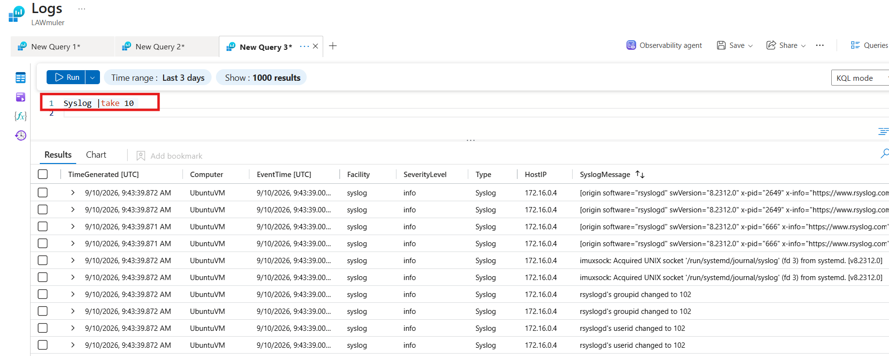
<sub>**Figure 6** — `Syslog` results in the legacy Logs blade on the Azure portal.</sub>

### 5. Portal migration

Microsoft Sentinel has moved to the unified security portal at **security.microsoft.com**. It can still be reached from the Azure portal today, but that route is slated for retirement. The same KQL runs unchanged in both experiences, so query skill transfers directly — what changes is navigation, tab handling and the incident workflow around the results.

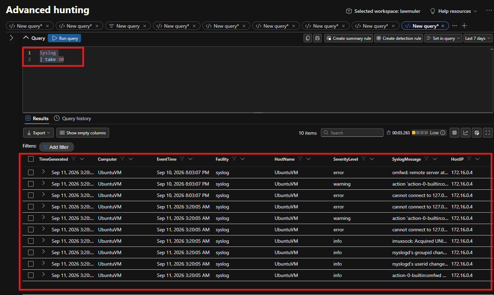
<sub>**Figure 7** — The same `Syslog` query in the new Advanced hunting interface (Defender portal).</sub>

| Portal | Experience | Status |
|---|---|---|
| Azure portal | Logs blade on the workspace | Being phased out |
| Defender portal | Advanced hunting, multi-tab queries | Target experience |

---

## Part 2 — Attack simulation & detection

Collecting logs is only half a SIEM. This part validates the environment the way that really counts: by launching a live SSH brute-force attack against a target VM and confirming Sentinel captures it.

```
1. Deploy target  →  2. Brute force  →  3. Compromise  →  4. Detect in Sentinel
```

### Scenario

Stand up a deliberately weak Linux VM, break into it over SSH with a password-guessing attack, then confirm the whole intrusion is visible in Sentinel.

| | |
|---|---|
| **Attacker** | `UbuntuVM` (existing lab host), via Azure Cloud Shell |
| **Target** | `TargetUbuntuVM` — new VM, **password auth enabled** |
| **Target public IP** | `20.81.249.104` · East US 2 |
| **Tool** | Hydra v9.5, parallel SSH login attempts |
| **Exposure** | NSG rule `UserRule_SSH` allows port 22 inbound |

> The target is intentionally soft — password auth left on, port 22 open to the source. In a real environment, these are exactly the misconfigurations you would be hunting *for*.

### Reaching the target

Before attacking, the connection path was confirmed: destination VM, public IP, port 22 reachable from the source, and the NSG rule that allows it. Connecting through **SSH via Azure CLI** opens a browser Cloud Shell that authenticates with a managed identity, so no private key is required.

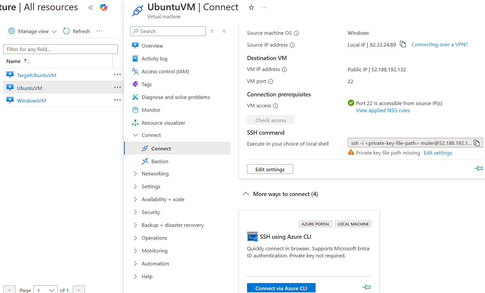
<sub>**Figure 8** — The Connect blade: destination VM, port 22, and the SSH-via-CLI option.</sub>

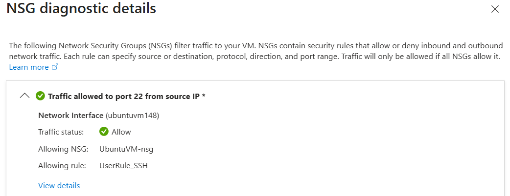
<sub>**Figure 9** — NSG diagnostics confirm `UserRule_SSH` on `UbuntuVM-nsg` explicitly allows port 22 from the source IP.</sub>

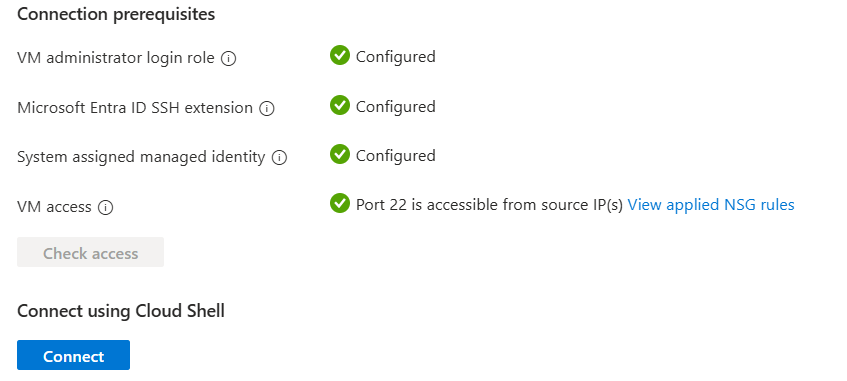
<sub>**Figure 10** — Entra ID SSH extension and a system-assigned managed identity are configured, enabling keyless Cloud Shell access.</sub>

### Launching the brute force

Two wordlist files — `UsernameList` and `PasswordList` — were staged in Cloud Shell to hold candidate credential combinations.

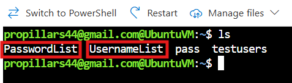
<sub>**Figure 11** — `UsernameList` and `PasswordList` created in the Cloud Shell home directory.</sub>

Hydra was then installed and pointed at the target's public IP:

```bash
# Update repositories and install the tool
sudo apt update && sudo apt upgrade
sudo apt install hydra

# Run parallel SSH login attempts against the target
hydra -L UsernameList -P PasswordList -T4 -V ssh://20.81.249.104
```

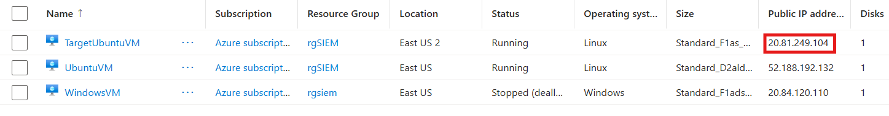
<sub>**Figure 12** — `TargetUbuntuVM` identified with public IP `20.81.249.104`.</sub>

Sixteen combinations were tried across four parallel tasks — and one succeeded:

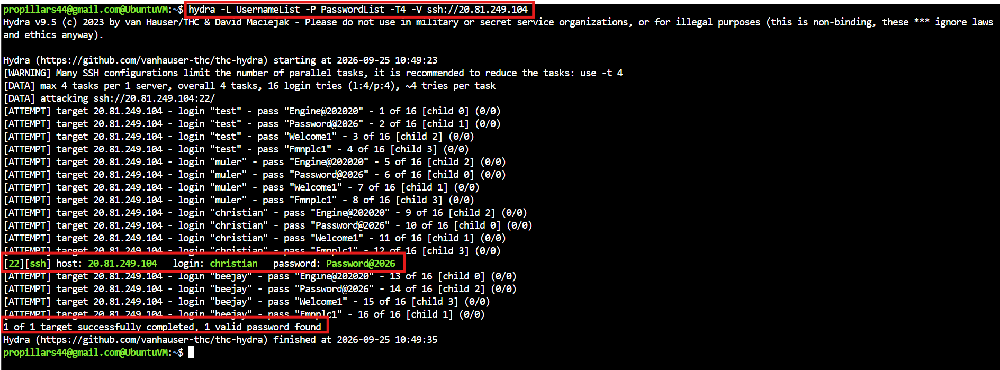
<sub>**Figure 13** — Hydra recovers a valid SSH credential: <code>1 of 1 target successfully completed, 1 valid password found</code>. The target is now compromised.</sub>

> Every one of those login attempts also generated an authentication event on the target — which is exactly what we go looking for next.

### Onboarding the target for detection

**Detection depends entirely on collection.** A VM only appears in Sentinel once a Data Collection Rule scopes it in. The new target was added to `myubuntuDCRnew` under the **Resources** tab, which also installs the Azure Monitor Agent and enables a system-assigned managed identity on the machine.

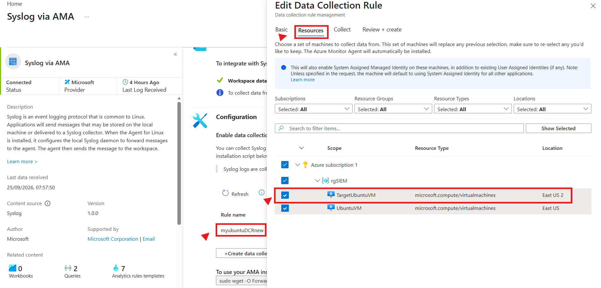
<sub>**Figure 14** — Editing `myubuntuDCRnew` to add `TargetUbuntuVM` as a collected resource.</sub>

> **Key takeaway:** if the target had not been added to the DCR, the attack would have succeeded *silently*. Sentinel can only detect what it is told to collect.

### Catching the attack in Sentinel

With telemetry flowing, the following query isolated the target and projected the fields that matter for an intrusion:

```kql
Syslog
| project TimeGenerated, EventTime, SyslogMessage, ProcessID, ProcessName, HostIP, Computer
| where Computer contains "TargetUbuntuVM"
```

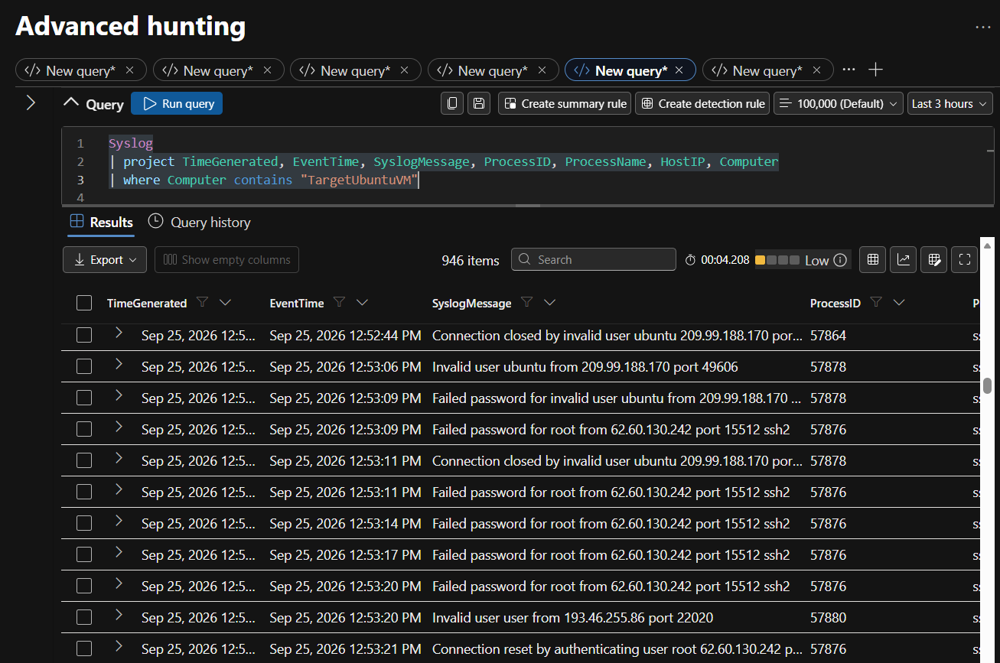
<sub>**Figure 15** — Advanced hunting (Defender portal): a flood of failed-password and invalid-user events against the target.</sub>

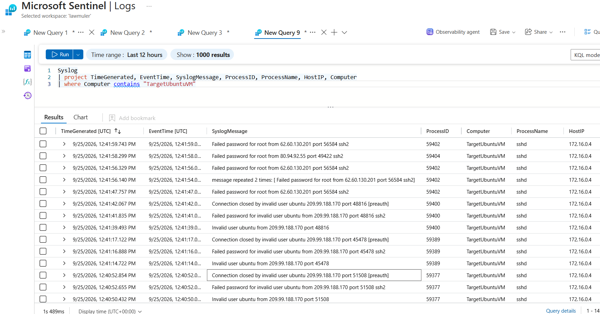
<sub>**Figure 16** — The same query in the Azure portal Logs blade, returning the identical events.</sub>

**What the captured logs reveal:**

- **Repeated authentication failures** — hundreds of failed-password and invalid-user events for `root` and `ubuntu` accounts: the classic brute-force fingerprint.
- **External source addresses** — attempts arriving from public IPs such as `209.99.188.170` and `62.60.130.242`, flagging internet-facing exposure.
- **Rich per-event context** — projecting `ProcessID`, `ProcessName`, `HostIP` and `Computer` ties every event to `sshd` on `TargetUbuntuVM` at `172.16.0.4`.
- **Both portals agree** — Advanced hunting and the legacy Logs blade return the same 900-plus events, confirming a consistent pipeline.

---

## Validation summary

| Check | Evidence | Result |
|---|---|:---:|
| Resource group provisioned | `rgSIEM` contains all lab resources in East US | ✅ |
| Workspace & SIEM enabled | `LAWmuler` active with the `SecurityInsights` solution | ✅ |
| Virtual machines running | `WindowsVM` and `UbuntuVM` both reachable and reporting | ✅ |
| Connectors healthy | Azure Activity, Windows Security Events, Syslog all **Connected** | ✅ |
| Windows ingestion proven | `SecurityEvent` returns rows sourced from `WindowsVM` | ✅ |
| Linux ingestion proven | `Syslog` returns rows sourced from `UbuntuVM` at `172.16.0.4` | ✅ |
| Attack detected | Hydra brute force against `TargetUbuntuVM` captured in Sentinel | ✅ |

---

## Observations & good practice

- **Co-locate workspace and workloads.** Same-region deployment keeps latency low and avoids cross-region transfer charges.
- **Standardise on the Azure Monitor Agent.** AMA is the supported collection path; the legacy MMA is retired. One agent covers both Windows and Linux.
- **Scope collection at the rule, not the agent.** Data Collection Rules decide which events are gathered and where they land — tight rules keep ingestion volume, and therefore cost, predictable. Sentinel is billed on data ingested and retained, so collection design is a cost decision as much as a security one.
- **Treat connector status as a daily check.** A connector showing *Connected* with a recent last-log timestamp is the fastest early warning that a telemetry source has gone silent.
- **You can only detect what you collect.** The single most important lesson from the attack phase: onboarding the target to the DCR is what made the intrusion visible at all.

---

## Next steps

- **Analytics rules** — promote the brute-force hunting query into a **scheduled analytics rule** so Sentinel raises an incident automatically the next time the pattern appears, moving from manual hunt to real-time detection. Enable and tune the 20 rule templates shipped with the Windows connector.
- **MITRE ATT&CK mapping** — map active detections to tactics and techniques (e.g. *T1110 — Brute Force*) to expose coverage gaps rather than assume them.
- **Workbooks & dashboards** — build workbooks over `SecurityEvent` and `Syslog` for an at-a-glance operational view.
- **Automation with playbooks** — use Logic App playbooks to enrich, notify and contain, shortening mean time to respond.
- **Further additions** — UEBA, threat-intelligence feeds, watchlists, Azure Arc for non-Azure hosts, and long-term retention tiers.

---

## Repository structure

```
.
├── README.md
├── Azure-Security-SIEM-Deployment.pptx    # full slide deck (25 slides)
├── Azure-Security-SIEM-Deployment.pdf     # PDF export (previews on GitHub)
└── assets/
    ├── 01-resource-group.png
    ├── 02-compute-infrastructure.png
    ├── 03-windows-security-events-ama.png
    ├── 04-syslog-via-ama.png
    ├── 05-kql-windows-securityevent.png
    ├── 06-kql-ubuntu-legacy-portal.png
    ├── 07-kql-ubuntu-defender-portal.png
    ├── 08-ssh-connect-blade.png
    ├── 09-nsg-diagnostic.png
    ├── 10-connection-prerequisites.png
    ├── 11-wordlists-cloudshell.png
    ├── 12-target-vm-public-ip.png
    ├── 13-hydra-attack-success.png
    ├── 14-dcr-add-target.png
    ├── 15-detection-advanced-hunting.png
    └── 16-detection-azure-logs.png
```

---

## Disclaimer

This is a personal lab built in an isolated Azure subscription for learning and portfolio purposes. The brute-force attack was performed **only against a virtual machine I own and control**. Never run offensive tooling such as Hydra against systems you are not explicitly authorised to test. Any IP addresses, hostnames or credentials shown in the screenshots belong to a disposable lab environment that no longer exists.

---

<sub>Built with Microsoft Sentinel, Azure Monitor Agent and KQL · East US · 2026</sub>
